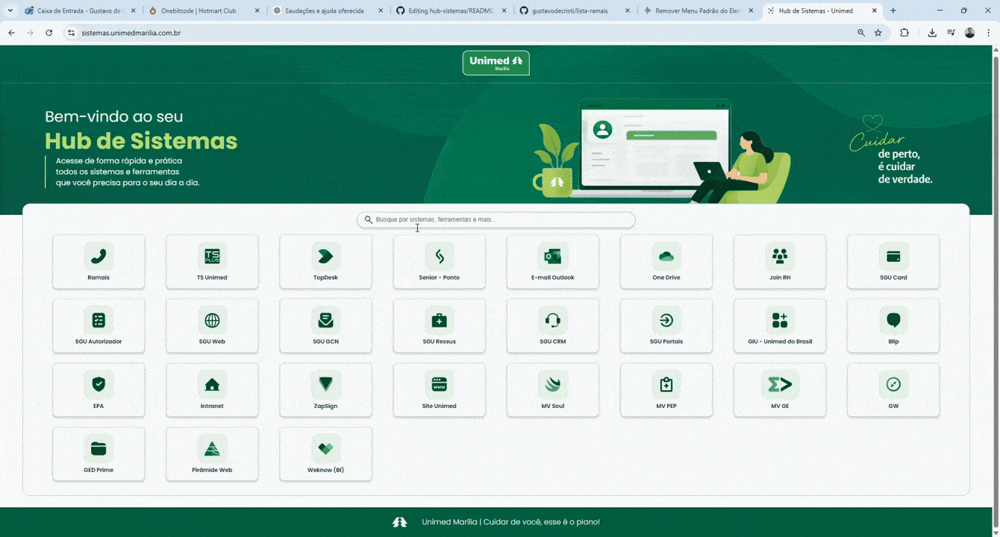

# 🚀 Hub de Sistemas

Sistema web desenvolvido para centralizar o acesso aos principais sistemas e ferramentas utilizados pelos colaboradores da empresa.

## 🎯 Objetivo

O Hub de Sistemas funciona como uma página inicial corporativa, permitindo que os usuários encontrem rapidamente os recursos necessários para suas atividades diárias, reduzindo o tempo gasto procurando links e aumentando a produtividade.

---

## 📸 Preview



---

## ✨ Funcionalidades

- Centralização dos sistemas corporativos
- Pesquisa rápida de sistemas
- Interface simples e intuitiva
- Acesso rápido com apenas um clique
- Organização visual dos recursos disponíveis
- Layout responsivo

---

## 🛠️ Tecnologias Utilizadas

- HTML5
- CSS3
- JavaScript

---

## 📂 Estrutura do Projeto

```text
hub-sistemas/
│
├── imagens/
│
├── index.html
├── style.css
├── script.js
│
└── README.md
```

---

## 🚀 Como Executar

### Clonar o projeto

```bash
git clone https://github.com/gustavodecristi/hub-sistemas.git
```

### Entrar na pasta

```bash
cd hub-sistemas
```

### Executar

Abra o arquivo:

```text
index.html
```

ou utilize a extensão Live Server do VS Code.

---

## 🔍 Como Funciona

O sistema apresenta uma lista de atalhos para os sistemas utilizados pela organização.

Através do campo de busca, o usuário pode localizar rapidamente um sistema específico sem precisar navegar por diversos portais ou documentos.

Toda a filtragem é realizada localmente utilizando JavaScript puro, garantindo rapidez e simplicidade.

---

## 👨‍💻 Autor

**Gustavo Bidoia**

Desenvolvedor Full Stack.

GitHub:
https://github.com/gustavodecristi
